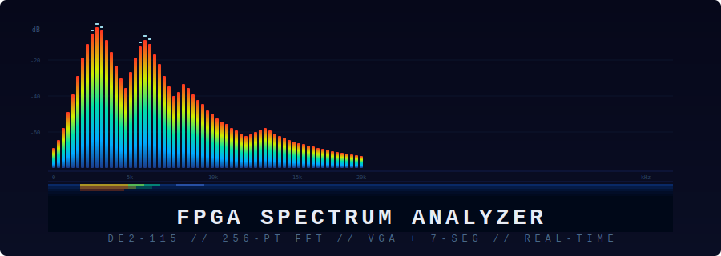
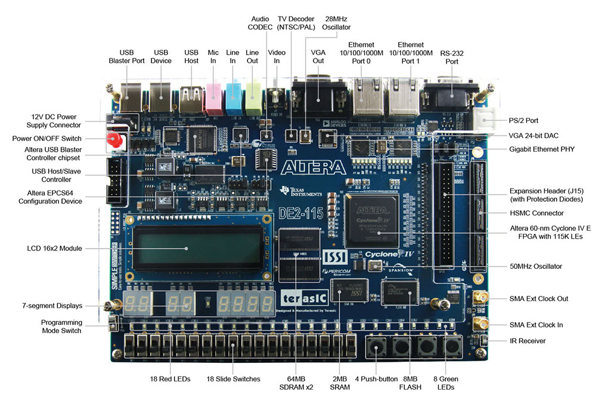
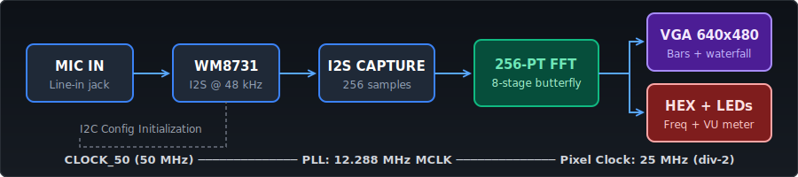
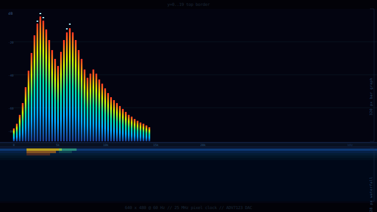

<p align="center">
  
</p>

<p align="center">
  <b>Real-time audio spectrum analyzer on a Cyclone IV FPGA</b><br>
  <sub>256-point FFT &nbsp;&bull;&nbsp; VGA output &nbsp;&bull;&nbsp; 7-segment display &nbsp;&bull;&nbsp; LED VU meter</sub>
</p>

<p align="center">
  
  
  
  
</p>

---

## What it does

Captures audio from the DE2-115's line-in jack, runs a 256-point radix-2 FFT in hardware, and displays the frequency spectrum in real time on both a VGA monitor and the board's 7-segment displays. Everything runs on the FPGA fabric at 50 MHz — no soft processor, no external memory, no software.

<p align="center">
  
</p>

<p align="center">
  
</p>

## VGA display

The VGA output is the centerpiece. 640x480 at 60 Hz, driven through the DE2-115's ADV7123 DAC.

<p align="center">
  
</p>

**Bar graph** (top 320 px) — 128 frequency bins, each 4 px wide with 1 px gap. Magnitudes are log-scaled using a priority-encoder with fractional interpolation for smooth response. Bars have instant attack and gradual decay (3 px/frame at 60 fps). The colour gradient runs through four 80 px zones: dark blue, cyan, green/yellow, and red at the top.

**Peak hold** — Bright cyan-white markers track the highest point per bin and slowly descend at ~15 px/s, giving that classic professional analyzer look.

**Waterfall spectrogram** (bottom 128 px) — A circular-buffer RAM stores the last 128 FFT frames, scrolling downward. Each row is coloured with a 5-zone heat-map palette: black through blue, cyan, yellow, red, and white for the loudest signals.

**Axis labels** — Hardware-rendered 4x5 pixel bitmap font. Y-axis shows gain in dB (0, -20, -40, -60, -80). X-axis shows frequency (0, 5k, 10k, 15k, 20k kHz). Font ROM is a 17-character, 85-entry constant array synthesised as pure LUTs.

**Divider strip** — Thin accent line with subtle border glow separates the bar graph from the waterfall.

## Board outputs

| Output | What it shows |
|---|---|
| **VGA** | 128-bin bar graph, peak hold, scrolling waterfall spectrogram |
| **HEX7–4** | Peak frequency in Hz (decimal, BCD-converted) |
| **HEX3–0** | Peak magnitude (hex) |
| **LEDR[17:0]** | VU meter — 18 LEDs with peak-hold and decay |
| **LEDG[0]** | PLL locked |
| **LEDG[1]** | WM8731 codec configured |
| **LEDG[2]** | FFT engine busy |
| **LEDG[3]** | Frame heartbeat (~10 ms pulse per audio frame) |

## Architecture

```
CLOCK_50 ──┬── PLL ──── 12.288 MHz MCLK ──── WM8731 codec
            │
            ├── I2C master ──── codec register init (11 regs)
            │
            ├── I2S capture ──── 16-bit samples @ 48 kHz
            │       │
            │       └── 256-sample frame buffer (bit-reversed addressing)
            │
            ├── FFT core ──── 8-stage radix-2 DIT butterfly
            │       │
            │       ├── twiddle ROM (128 x 32-bit, cos|sin)
            │       └── magnitude estimator (|Re| + |Im|/4)
            │
            ├── Peak detector ──── tracks max bin per frame
            │       └── BCD converter (double-dabble) ──── HEX displays
            │
            ├── VGA display ──── pixel pipeline @ 25 MHz
            │       ├── bar graph (log-scaled, animated)
            │       ├── peak hold markers
            │       ├── waterfall RAM (128x128x8, M9K block RAM)
            │       ├── colour gradient engine
            │       └── font ROM + axis label overlay
            │
            └── VU meter ──── peak-hold with decay ──── LEDR[17:0]
```

## File structure

```
├── spectrum_analyzer_top.sv     # Top-level: all SV modules (I2C, I2S, FFT, etc.)
├── vga_spectrum_display.vhd     # VGA display entity (VHDL-93)
├── pll_audio.vhd                # Quartus PLL IP: 50 MHz → 12.288 MHz
├── pll_audio.qip                # PLL IP integration file
├── spectrum.qpf                 # Quartus project file
├── spectrum.qsf                 # Quartus settings + pin assignments
├── pin_assignments.tcl          # TCL script for all pin assignments
└── docs/
    ├── banner.svg               # README banner graphic
    ├── pipeline.svg             # Signal pipeline diagram
    └── vga_layout.svg           # VGA display layout diagram
```

## Building

**Requirements:** Quartus Prime 25.1 Lite (or later), DE2-115 board, VGA monitor, audio source with 3.5mm cable.

1. Clone the repo and open `spectrum.qpf` in Quartus

2. Run the pin assignment script:
   ```
   Tools → Tcl Scripts → pin_assignments.tcl → Run
   ```
   Or from the Tcl console: `source pin_assignments.tcl`

3. Verify source files are registered:
   - `spectrum_analyzer_top.sv` (SystemVerilog)
   - `vga_spectrum_display.vhd` (VHDL)
   - `pll_audio.qip` (PLL IP)

   Check under Project → Add/Remove Files. Paths must be relative (no leading `/`).

4. Compile: `Processing → Start Compilation` (Ctrl+L)

5. Program: `Tools → Programmer → Start` (USB-Blaster, `.sof` file)

6. Connect a VGA monitor and audio source, press KEY[0] to release reset

## How the FFT works

The `fft_core` implements a radix-2 decimation-in-time butterfly across 8 stages (log2(256) = 8). Input samples are stored in bit-reversed order by `i2s_capture` so the output comes out in natural order.

Each butterfly reads two complex values from RAM, multiplies the lower one by the appropriate twiddle factor from ROM (fixed-point Q15), and writes back the sum and difference with a right-shift for scaling. The twiddle ROM stores 128 entries of packed cos|sin in a single 32-bit word.

After all 8 stages, the magnitude estimator approximates `sqrt(Re^2 + Im^2)` using the fast formula `max(|Re|,|Im|) + min(|Re|,|Im|)/4`, which is accurate to within ~4% and costs zero multipliers.

## How the VGA display works

The display runs a 2-stage pixel pipeline at 50 MHz (25 MHz pixel rate via toggle enable):

- **Stage 0:** Determines the bin index from the x-coordinate using a synthesis-time LUT (divide-by-5 and mod-5, no runtime divider), reads the bar height and peak value from register arrays, and issues the waterfall RAM address.

- **Stage 1:** Generates the pixel colour based on zone (bar area, divider, waterfall, border), applies the 4-zone gradient for bars, renders peak-hold markers, overlays grid lines, and runs the heat-map palette for waterfall pixels. Finally, the font overlay checks if the current pixel belongs to an axis label character and renders it in blue-gray.

The waterfall uses 16 KB of block RAM (128 rows x 128 columns x 8-bit intensity, inferred as M9K). A circular row pointer advances each FFT frame, so the display scrolls without any data movement.

## Pin map

All 88 pins are assigned via `pin_assignments.tcl`:

| Group | Pins | I/O Standard |
|---|---|---|
| Clock | `CLOCK_50` (PIN_Y2) | 3.3-V LVTTL |
| Keys | `KEY[3:0]` | 2.5 V |
| Audio | `AUD_XCK`, `BCLK`, `ADCLRCK`, `ADCDAT`, `DACLRCK`, `DACDAT` | 3.3-V LVTTL |
| I2C | `I2C_SCLK`, `I2C_SDAT` | 3.3-V LVTTL |
| VGA | `VGA_CLK`, `HS`, `VS`, `BLANK_N`, `SYNC_N`, `R/G/B[7:0]` | 3.3-V LVTTL |
| 7-Seg | `HEX0`–`HEX7` (7 bits each) | 2.5 V |
| LEDs | `LEDG[7:0]`, `LEDR[17:0]` | 2.5 V |

## Technical specs

| Parameter | Value |
|---|---|
| FFT size | 256 points |
| Sample rate | 48 kHz (WM8731) |
| Frequency resolution | 187.5 Hz/bin |
| Displayable range | 0–24 kHz (128 bins, Nyquist) |
| VGA resolution | 640 x 480 @ 60 Hz |
| Pixel clock | 25 MHz (50 MHz / 2) |
| Audio MCLK | 12.288 MHz (PLL from 50 MHz) |
| Waterfall depth | 128 frames (~27 s at 4.7 fps) |
| Block RAM usage | ~16 KB (waterfall) + twiddle ROM |
| Target device | EP4CE115F29C7 (Cyclone IV E, 115K LEs) |

## Codec configuration

The WM8731 is configured over I2C at startup with 11 register writes:

| Register | Value | Function |
|---|---|---|
| `0x1E` | `0x00` | Reset |
| `0x00` | `0x17` | Left line-in volume |
| `0x02` | `0x17` | Right line-in volume |
| `0x04` | `0x79` | Left headphone volume |
| `0x06` | `0x79` | Right headphone volume |
| `0x08` | `0x15` | Analog path: mic boost off, line-in select, DAC select |
| `0x0A` | `0x00` | Digital path: no de-emphasis, no filters |
| `0x0C` | `0x00` | Power: everything on |
| `0x0E` | `0x42` | Interface: I2S, 16-bit, slave mode |
| `0x10` | `0x00` | Sampling: normal mode, 48 kHz |
| `0x12` | `0x01` | Active |

## License

MIT

---

<p align="center">
  <sub>Built for the DE2-115 &nbsp;&bull;&nbsp; Vanderbilt University &nbsp;&bull;&nbsp; ECE 4377</sub>
</p>
